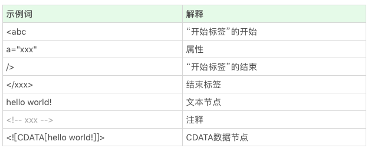

# 浏览器-解析`HTML`代码，构建`DOM`树

1. 构建过程：
   
2. 词（token）
   
3. **状态机**： 用于将字符流解析成词。实现状态的方式就是将每个函数当做一个状态，参数是接收的字符，返回值是一下一个函数。

```javascript
var data = function(c) {
  if (c == "&") {
    return characterReferenceInData;
  }
  if (c == "<") {
    return tagOpenState;
  } else if (c == "\0") {
    error();
    emitToken(c);
    return data;
  } else if (c == EOF) {
    emitToken(EOF);
    return data;
  } else {
    emitToken(c);
    return data;
  }
};
var tagOpenState = function tagOpenState(c) {
  if (c == "/") {
    return endTagOpenState;
  }
  if (c.match(/[A-Z]/)) {
    token = new StartTagToken();
    token.name = c.toLowerCase();
    return tagNameState;
  }
  if (c.match(/[a-z]/)) {
    token = new StartTagToken();
    token.name = c;
    return tagNameState;
  }
  if (c == "?") {
    return bogusCommentState;
  } else {
    error();
    return dataState;
  }
};
//……
```

4. 设计`HTML`语法分析器：使用栈，栈顶元素是当前元素，遇到属性添加到当前节点。遇到文本节点，如果当前节点是文本节点，就合并文本节点，否则入栈成为当前节点的子节点。遇到注释，作为当前节点的子节点，遇到 tag start 就入栈一个节点，作为当前节点的子节点，遇到 tag end 就出栈一个节点。

```javascript
function HTMLSyntaticalParser() {
  var stack = [new HTMLDocument()];
  this.receiveInput = function(token) {
    //……
  };
  this.getOutput = function() {
    return stack[0];
  };
}
```

5. 相关链接：[构建DOM树规则](http://w3c.github.io/html/syntax.html#tree-construction)
