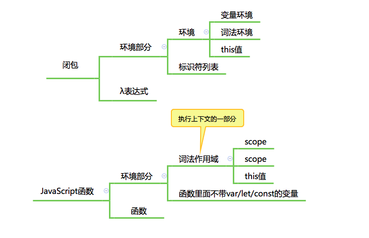

# JavaScript 执行-函数的执行（一）

[toc]

## 函数执行过程



## 闭包

**闭包**： 就是一个绑定了执行环境的函数。

### JavaScript 中闭包的组成

- 环境部分 + 环境：函数的词法环境 + 标识符列表：函数中未用到的未声明的变量
- 表达式部分：函数体

## 执行上下文

JavaScript 标准把一段代码执行所需的所有信息定以为“**执行上下文**”。

### ES2018 中执行上下文组成

- lexical envioronment : 词法环境，获取变量或 this 值时使用
- variable envioronment: 变量环境，当声明变量时使用
- code evaluation state: 用于恢复代码执行位置
- Function： 执行的任务是函数时使用，表示正在被执行的函数
- ScriptOrModule: 执行的任务是脚本或模块时使用，表示正在被执行的代码
- Realm： 使用的基础库和内置对象实例
- Generator： 仅生成器上下文有这个属性，表示当前生成器

### var 声明与复制

var 声明作用域就是函数执行的作用域，也就是说，var 可以穿透 if ，for 等语句。

### let

**产生 let 作用域的语句**

- `for`
- `if`
- `switch`;
- `try/catch/finally`

### Realm

包含一组完整的内置对象，而且是复制关系。在不同 Realm 中的对象操作，会有一些需要格外注意的问题。比如 `instanceof`几乎是失效的。

### **立即执行函数表达式**

通过创建一个函数并且立即执行来构造一个新的域，从而控制 var 的范围。

**常见的方法**就是**加括号**，推荐在括号前面加上分号。

```javascript
(function() {
  var a;
  //code
})();
```

**加括号的缺点**：如果上一行不写括号，括号会被解释为上一行代码最末的函数调用。
**推荐方法：**使用`void` 关键字，这种写法的好处是避免语法问题，同时 void 运算可以忽略后面表达式的值，更合语义。

```
void function(){
	//code;
}();
```
