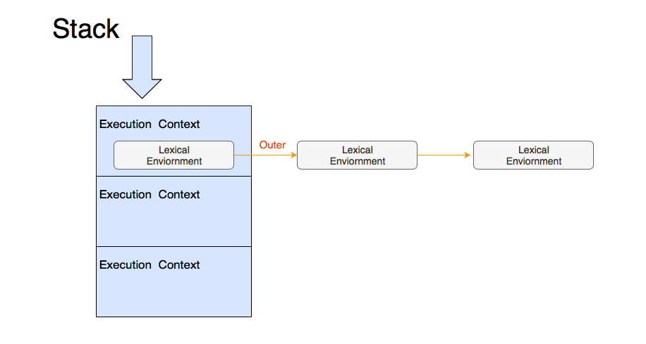

# JavaScript 执行-函数调用切换上下文

## 函数家族

1. 普通函数：用 function 关键字定义的函数。

   ```javascript
   function foo() {
     // code
   }
   ```

2. 箭头函数：用 => 运算符定义的函数。

   ```javascript
   const foo = () => {
     // code
   };
   ```

3. 方法：在 class 中定义的函数

   ```javascript
   class C {
     foo() {
       //code
     }
   }
   ```

4. 生成器函数：用 function \* 定义的函数。

   ```javascript
   function foo*(){
       // code
   }
   ```

5. 类：用 class 定义的类，实际上也是函数。

   ```javascript
   class Foo {
     constructor() {
       //code
     }
   }
   ```

6. 异步函数：普通函数、箭头函数和生成器函数加上 `async` 关键字
   `javascript async function foo(){ // code } const foo = async () => { // code } async function foo*(){ // code }`
   不同函数的差异：在于 this 关键字

## this 关键字

### Reference 类型

**组成部分**： 一个对象和一个属性值。
**使用：**作算术运算或者其他运算时，Reference 类型被解引用，获取真正的值来参加运算。进行类似函数调用、delete 等操作时，需要用到 Reference 类型中的对象。

### this 在不同函数中的行为

调用函数时使用的引用，决定了函数执行时刻的 this 值。

1. 普通函数的`this`值是由调用它所使用的引用决定的。我们在获取函数的表达式实际上返回的并非函数本身，而是 Reference 类型。
2. 箭头函数，不论用什么引用来调用它，都不影响它的 this 值。
3. 生成器函数、异步生成器函数和异步普通函数跟普通函数行为是一致的。异步箭头函数与箭头函数行为是一致的。

### this 关键字的机制

#### 执行上下文

在 JavaScript 标准中，为函数规定了用来保存定义时的上下文的私有属性[[Environment]]。当一个函数执行时，会创建一条新的执行环境记录，记录的外层词法环境（outer lexical envionment）会被设置为函数的[[Envioronment]]。这个动作叫做**切换上下文**。

##### 执行上线文切换机制

函数能够访问定义时的词法环境，不能访问执行时的词法环境。

##### 管理执行上下文

JavaScript 中使用一个栈来管理执行上下文，这个栈中的每一项包含一个链表，就是外层词法环境的指针。当函数调用时，入栈一个新的执行上下文。函数调用结束时，执行上下文被出栈。


#### this 机制

##### [[thisMode]]私有属性

JavaScript 定义了[[thisMode]]私有属性，有下列 3 个取值：

- **lexical**： 表示从上下文中找 this，对应了箭头函数
- **global**： 表示当 this 为 undefined 时，取全局对象，对应了普通函数
- **strict**： 当严格模式时使用，this 严格按照调用时传入的值，可能为 null 或者 undefined。

##### 记录 this 值

函数创建新的执行上下文中的词法环境记录时，会根据[[thisMode]]来标记新纪录的[[ThisBindingStatus]]私有属性。代码执行遇到 this 时，会逐层检查当前词法环境记录中的[[ThisBindingStatus]],当找到有 this 的环境记录时，获取 this 的值。

嵌套的箭头函数中的代码都指向外层 this。

#### 操作 this 的内置函数

1. `Function.prototype.call` 和 `Function.prototype.apply` 可以指定函数调用时传入的 this 值。
2. `Function.prototype.bind` 可以生成一个绑定过的函数

`call`、`bind`和`apply` 无法改变 class ，箭头函数的 this，但是可以传参。
