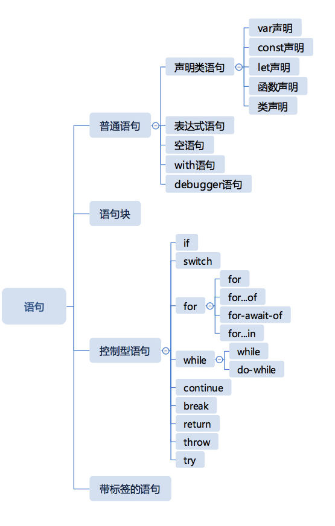
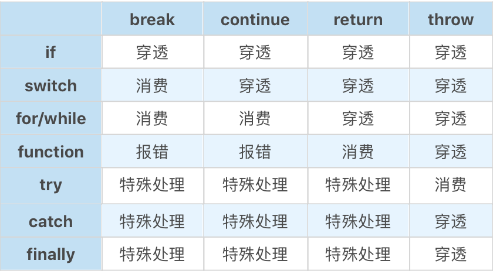

# JavaScript 执行-语句

**常见的语句：**变量声明、表达式、条件和循环等。

## Completion 类型

Comletion Record **_用于描述异常、跳出等语句执行过程，表示一个语句执行完后的结果_**，有 3 个字段：

- **[[type]]** 表示完成的类型，有 break,continue,return,throw 和 normal 几种类型。
- **[[value]]** 表示语句的返回值，如果语句没有，则是 empty。
- **[[target]]** 表示语句目标，通常是一个 JavaScript 标签。

**作用**：JavaScript 依靠语句的 Completion Record 类型在语句复杂的嵌套结构中，实现各种控制。

## JavaScript 依靠 Completion Record 控制语句执行的过程

### 语句

#### 普通语句

不带控制能力的语句称为普通语句。

##### 分类

- 声明类语句 + var 声明 + const 声明 + let 声明 + 函数声明 + 类声明
- 表达式
- 空语句
- debugger 语句

##### 执行顺序

从前到后顺序执行（忽略 var 和 函数声明的预处理机制）

##### 执行结果

普通语句执行后，会得到[[type]]为 normal 的 Completion Record,只有表达式语句才会产生[[value]]。JavaScript 引擎遇到这样的 Completion Record 会继续执行下一条语句。

#### 语句块

使用大括号括起来的一组语句，它是一种语句的复合结构，可以嵌套。如果内部语句的 Completion Record 的[[type]] 不为 normal，会打断语句块后续的语句执行。也就是说，非 normal 的完成类型可以穿透复杂的语句嵌套结构，产生控制效果。

#### 控制型语句

分为两部分：

- 一类对其内部造成影响，如 if 、switch、while/for ，try
- 一类对外部造成影响，如 break、continue、return、throw 等。

##### 两两组合效果

#### 带标签的语句

**用途**： 大多是类似注释，可以与完成记录类型中的 target 相配合，用于跳出多层循环。
break/continue 语句后如果跟了关键字，就产生带 target 的完成记录。一旦完成记录带了 target，只有拥有 label 的语句会消费它。
