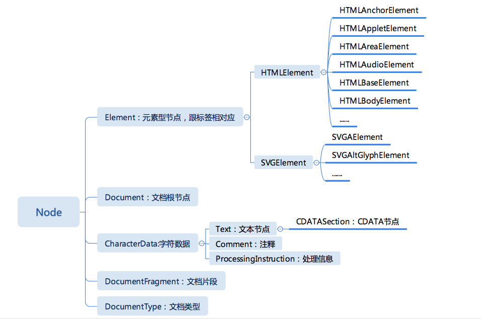

# DOM API

[toc]

## 介绍

**文档对象模型**： 使用树形的对象这样模型来描述文档（包括 HTML 和 XML 文档，本章只讨论 HTML 文档）。 ##组成

- **节点**：DOM 树形结构中的节点相关的 API。
- **事件**：触发和监听事件相关的 API。
- **Range**： 操作文字范围相关 API。
- **遍历**： 遍历 DOM 相关的 API。

## 节点

所有节点都有一个统一的接口 Node。按照继承关系能够把 Node 和其子类梳理成为下图的一棵树：


### 节点的对应写法

除了 Document 和 DocumentFragment 之外，都有与之对应的 HTML 写法：

```
Element: <tagname>...</tagname>
Text: text
Comment: <!-- comments -->
DocumentType: <!Doctype html>
ProcessingInstruction: <?a 1?>
```

### Node

Node 是 DOM 树继承关系的根节点，它定义了 DOM 节点 DOM 树上的操作。

#### 属性

提供了前后父子几种关系，能够根据相对位置获取元素。

- `parentNode`
- `childNodes`
- `firstChild`
- `lastChild`
- `nextSibling`
- `previousSibling`

#### 操作方法

这几个修改型的 API 都是在父元素上操作的。

- `appendChild()`
- `insertBefore()`
- `removeChild()`
- `replaceChild()`

#### 高级 API

- `compareDocumentPosition` 是一个用于比较两个节点中关系的函数。
- `contains` 检查一个节点是否包含另一个节点的函数。
- `isEqualNode` 检查两个节点是否完全相同。
- `isSameNode` 检查两个节点是否是同一个节点，实际上在 JavaScript 中可以用“===”。
- `cloneNode` 复制一个节点，如果传入参数 true，则会连同子元素做深拷贝。

#### 创建节点的方法

- `createElement`
- `createTextNode`
- `createCDATASection`
- `createComment`
- `createProcessingInstruction`
- `createDocumentFragment`
- `createDocumentType`

### Element 和 Attribute

Element 表示元素，是 Node 的子类

1. 将元素的 Attribute 当做字符串看待相关的 API

- `getAttribute`
- `setAttribute`
- `removeAttribute`
- `hasAttribute`

2. 把元素的 Attribute 当做节点

- `getAttributeNode`
- `setAttributeNode`

3. 像 property 一样访问 attribute

- 使用`attributes`对象

#### 查找元素

- `querySelector`
- `querySelectorAll`
- `getElementById`
- `getElementsByName`
- `getElementsByTagName`
- `getElementsByClassName`

##### 建议

尽量使用 getElement 系列的 API，性能更好

## 遍历

DOM API 提供了**NodeIterator** 和**TreeWalker**来遍历树。比起直接用属性遍历，**好处**是提供了过滤功能，还可以把属性节点包含在遍历之内。

### NodeIterator

```javascript
var iterator = document.createNodeIterator(
  document.body,
  NodeFilter.SHOW_TEXT | NodeFilter.SHOW_COMMENT,
  null,
  false
);
var node;
while ((node = iterator.nextNode())) {
  console.log(node);
}
```

### TreeWalker

```javascript
var walker = document.createTreeWalker(
  document.body,
  NodeFilter.SHOW_ELEMENT,
  null,
  false
);
var node;
while ((node = walker.nextNode())) {
  if (node.tagName === "p") node.nextSibling();
  console.log(node);
}
```

TreeWalker 的**好处**是：多了在 DOM 树上自由移动当前节点的能力。

#### 遍历建议

直接使用递归和 Node 属性。

## Range

### 创建

1. 设置它的起止

   ```javascript
   var range = new Range(),
     firstText = p.childNodes[1],
     secondText = em.firstChild;
   range.setStart(firstText, 9); // do not forget the leading space
   range.setEnd(secondText, 4);
   ```

2. 从用户选中区域创建

   ```
   var range = document.getSelection().getRangeAt(0);
   ```

### 更改 Range 选中区域

主要是取出和插入。分别由 `extractContents` 和 `insertNode`来实现

```javascript
var fragment = range.extractContents();
range.insertNode(document.createTextNode("aaaa"));
```
