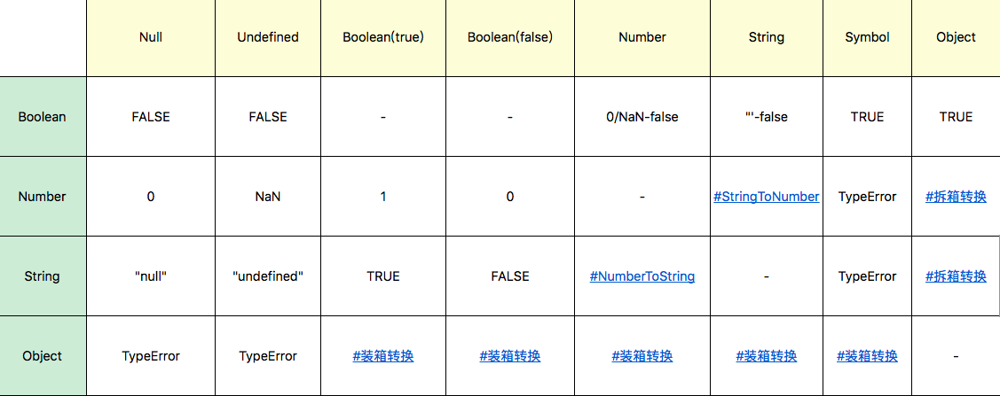

# `JavaScript`类型

1. 为什么有的编程规范要求使用`void 0`代替`undefined`?  
   **答：因为`JavaScript`的代码`undefined`是一个变量，并非是关键字。为了避免被无意篡改，所以使用`void 0`获取`undefined`值。**(在`ES5`之前)
2. 字符串是否有最大长度？  
   **答：** `String`有最大长度`2^53-1`，但是这里的最大长度不是字符数，而是字符串的`utf-16`编码。字符串操作`charAt`,`charCodeAt`、`length`等方法都是针对`utf-16`编码。所以，字符串的最大长度实际上是受字符串编码长度影响的。
3. `+0`和`-0`的区别  
   **答：**在加法运算中没有区别，在除法运算中，`1/+0`返回`Infinity`,`1/-0`返回`-Infinity`。
4. 为什么在`JavaScript` 中，0.1+0.2 不能等于 0.3？  
   **答：** 浮点运算精度问题，非整数的`Number`类型无法使用`==`(或`===`)来比较。
5. 如何正确比较浮点数？  
   **答:**检查等式左右两边差的绝对值是否小于最小精度，即与`Number.EPSILON`进行比较。

	```javascript
	Math.abs(0.1 + 0.2 - 0.3) <= Number.EPSILON;
	```

6. **`Symbol`**类型拥有哪些部分？表示是什么意思？如何创建`Symbol`类型。  
   **答：** 1. `Symbol`可以具有字符串类型的描述，即使描述相同，`Symbol`也不相等。 2. 创建：使用全局的`Symbol`函数
7. 为什么给对象添加的方法能用在基本类型上？  
   **答：**运算符提供了**装箱**操作，它会根据基础类型创建一个临时对象，使得能够在基础类型上调用对应对象的方法。
8. 构造器两种使用  
   `Number`、`Boolean`和`String` 这三个构造器可以两用。当跟`new`搭配时，它们产生对象。当直接调用时，表示强制类型转换。
9. 类型转换规则  
   
10. **StringToNumber** 多数情况下，`Number`是比`parseInt`和`parseFloat`更好的选择。
11. 产生装箱  
    1. 使用一个函数的`call`方法来强迫产生装箱

    ```javascript
    var symbolObject = (function(){return this;}).call(Symbol('a'));
    ```

    2. 使用内置的`Object`函数显式调用装箱能力

    ```
    var symbolObject = Object(Symbol('a'));
    ```

12. 准确识别对象对应的基本类型：`Object.prototype.toString`
13. 拆箱  
    在 JavaScript 标准中，规定了 ToPrimitive 函数，它是对象类型到基本类型的转换（即，拆箱转换）。  
    **步骤：** 尝试调用`valueOf`和`toString`来获得拆箱后的基本类型。如果二者都不存在，或者没有返回基本类型，则会产生类型错误`TypeError`。  
    **覆盖：** 在`ES6`之后，可以通过显示指定`toPrimitive Symbol`覆盖原来的行为。
14. 其他规范类型
	+ `List` 和 `Record`： 用于描述函数传参过程。
	+ `Set`：主要用于解释字符集等。
	+ `Completion Record`：用于描述异常、跳出等语句执行过程。
	+ `Reference`：用于描述对象属性访问、delete 等。
	+ `Property Descriptor`：用于描述对象的属性。
	+ `Lexical Environment` 和 `Environment Record`：用于描述变量和作用域。
	+ `Data Block`：用于描述二进制数据。
